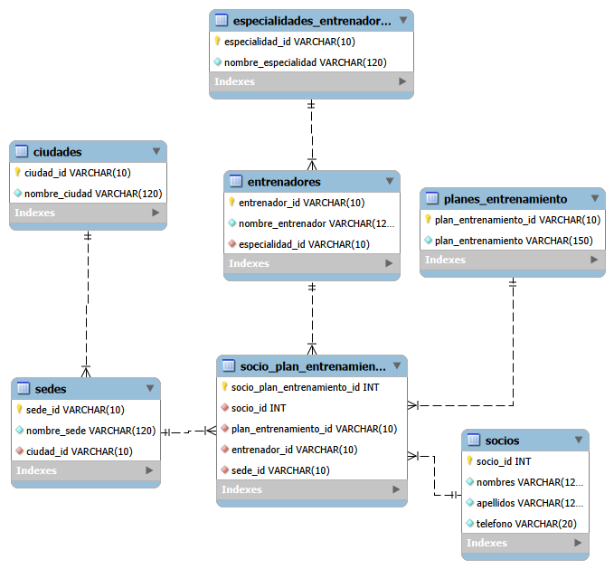

# Sistema de Gestión para Gimnasio (`review-mysql`)

Este proyecto consiste en el diseño, implementación y administración de una base de datos relacional orientada a la gestión integral de un gimnasio. El modelo se encuentra completamente normalizado hasta la **Cuarta Forma Normal (4FN / BCNF)** para garantizar la integridad de los datos, eliminar redundancias y optimizar el rendimiento mediante consultas avanzadas, rutinas automáticas y control de acceso.

---

##  Estructura del Proyecto

```text
review-mysql/
│
├── evidencia/                  # Capturas de pantalla y diagramas entidad-relación (ER)
│
└── sql/                        # Scripts SQL del sistema
    ├── ddl/                    # Definición de estructura de datos (CREATE TABLE, INDEX)
    ├── dml/                    # Manipulación e inserción de datos iniciales (INSERT)
    ├── dql/
    │   └── consulta-avanzada.sql # Consultas relacionales (JOINs, agrupaciones y filtros IN)
    ├── evento/
    │   └── events.sql          # Eventos programados de MySQL (Event Scheduler)
    ├── funciones/
    │   └── functions.sql       # Funciones personalizadas almacenadas
    ├── procedures/
    │   └── procedures.sql      # Procedimientos almacenados para transacciones
    ├── trigger/
    │   └── trigger.sql         # Disparadores automáticos y tablas de auditoría
    └── user-privilegios/
        └── user_privileges.sql # Gestión de usuarios, roles y permisos de seguridad

```

## entidad relacion

